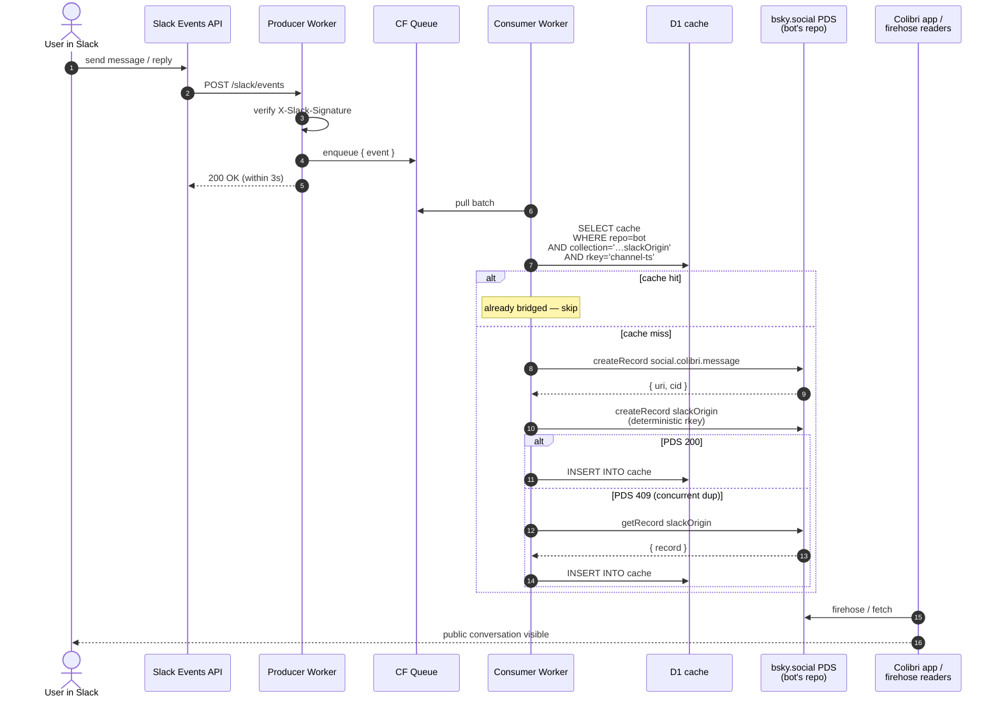

> **Status:** Draft proposal. Looking for feedback.

A one-way sync that mirrors Slack messages from the FoC Slack workspace into the [Colibri](https://colibri.social) atproto network, so the conversation data ends up public and consumable via the atproto firehose.

## Why this shape

- **Lowest-risk path to atproto.** The [social.colibri](https://lexicon.garden/browse/social.colibri) lexicon is the most fleshed-out Slack-shaped lexicon already on atproto. Reusing it lets us playtest Colibri as a Slack replacement without designing a new schema.
- **Slack stays canonical.** One-way (Slack → atproto). No write-back.
- **Public by default.** Records on atproto are public.

## Architecture

1. **Slack Events API** pushes message events to a Cloudflare Worker (the *producer*). It verifies Slack's HMAC signature, enqueues the event, and acks within Slack's 3-second budget.
2. **Cloudflare Queue** holds events durably. A consumer Worker pulls batches and publishes to atproto. Queue retries cover PDS slowness and rate limits.
3. **atproto is the source of truth.** The bot's bsky.social repo holds the published Colibri messages and our own sidecar records. The PDS is the dedupe authority — see Race resolution.
4. **Cloudflare D1 (SQLite)** holds:
   - A single `cache` table — dumb projection of atproto records from any repo, keyed by `(repo, collection, rkey)`, body stored opaquely as JSON. Wipe it and the firehose rebuilds it.
   - Separate private tables (e.g. `oauth_tokens` in v2) for credentials that can't go on atproto.

### Sequence diagram



ASCII fallback:

```
 Slack user
    │
    ▼
 Slack Events API ──▶ Producer Worker (verify, ack <3s)
                              │
                              ▼
                         CF Queue
                              │
                              ▼
                     Consumer Worker
                              │
                  SELECT cache (repo, collection, rkey)
                              │
                  hit ──┼── miss
                        ▼     ▼
                     skip    createRecord(message, slackOrigin)
                              │
                     PDS 200  │  PDS 409 (race)
                       ▼      ▼
                  INSERT cache    getRecord, INSERT cache
                              │
                              ▼
                       firehose ──▶ Colibri app
```

## Storage model

atproto holds the public truth. D1 contains:

- A single **`cache`** table — a polymorphic key-value mirror of atproto records from any repo, keyed by `(repo, collection, rkey)` with the record body stored as JSON. Dumb projection: no bridge bookkeeping, no fields that aren't already on atproto. Wipe it and the firehose rebuilds it.
- Separate **private** tables for state that can't go on atproto (v2 OAuth tokens).

Queries that need particular fields use SQLite's JSON1 functions:

```sql
-- "what's the colibri channel for slack channel C123?"
SELECT json_extract(record, '$.colibriChannelUri') FROM cache
WHERE repo = 'did:plc:<bot>'
  AND collection = 'com.feelingof.bridge.slackChannel'
  AND rkey = 'C123';
```

### Schema sketch

```sql
CREATE TABLE cache (
  repo        TEXT NOT NULL,            -- DID of the repo this record lives on
  collection  TEXT NOT NULL,            -- e.g. 'com.feelingof.bridge.slackOrigin'
  rkey        TEXT NOT NULL,
  record      TEXT NOT NULL,            -- JSON; lexicon-conformant record body
  cached_at   INTEGER NOT NULL,
  PRIMARY KEY (repo, collection, rkey)
);

-- v2; private; never on atproto
CREATE TABLE oauth_tokens (
  slack_user_id      TEXT PRIMARY KEY,
  did                TEXT NOT NULL,
  access_token_enc   BLOB,
  refresh_token_enc  BLOB NOT NULL,
  expires_at         INTEGER NOT NULL,
  scope              TEXT,
  updated_at         INTEGER NOT NULL
);
```

### Race resolution

The PDS is the dedupe authority via the deterministic rkey on `com.feelingof.bridge.slackOrigin`. The consumer:

1. Check `cache` for `(repo=bot-did, collection='…slackOrigin', rkey='channel-ts')`. Hit → skip.
2. Miss → `createRecord` on PDS. 200 means we won the race. 409 means another consumer already published; `getRecord` fetches the canonical record.
3. Either path → INSERT into `cache`.

Cache staleness is the residual risk: an upstream edit on the PDS leaves our row out of date until it's evicted. Our sidecar records are mostly write-once so this is rare in practice; v0 ignores it.

## Lexicons

### Reused: `social.colibri.message`

- `text` ← Slack text (truncated to 2048 chars, prefixed `**@user:** ` for attribution — see Identity)
- `channel` ← via the `com.feelingof.bridge.slackChannel` sidecar
- `parent` ← parent's `slackOrigin.messageUri` → rkey
- `createdAt` ← Slack `ts`
- `facets` ← mentions, links (v0.1)
- `attachments` ← deferred (Slack files need blob re-upload)

### New: `com.feelingof.bridge.slackOrigin`

Provenance + dedupe authority. One-to-one with a `social.colibri.message`. `key: "any"` so we control the rkey:

```
rkey = `${slackChannelId}-${slackTs.replace('.','-')}`
```

A redelivered Slack event hits a 409 at the PDS — that's what makes the bridge idempotent regardless of cache state. We can't put the deterministic rkey on the message itself: `social.colibri.message` uses `key: "tid"`, which expects monotonically-increasing TIDs per repo — backfilling old Slack history after live messages would be rejected. The sidecar sidesteps this; the message gets a fresh PDS-minted TID, the sidecar's `messageUri` carries the bridge.

```json
{
  "lexicon": 1,
  "id": "com.feelingof.bridge.slackOrigin",
  "defs": {
    "main": {
      "type": "record",
      "key": "any",
      "record": {
        "type": "object",
        "required": ["messageUri", "slackChannelId", "slackTs", "createdAt"],
        "properties": {
          "messageUri":     { "type": "string", "format": "at-uri" },
          "slackChannelId": { "type": "string" },
          "slackTs":        { "type": "string" },
          "slackUserId":    { "type": "string" },
          "createdAt":      { "type": "string", "format": "datetime" }
        }
      }
    }
  }
}
```

### New: `com.feelingof.bridge.slackChannel`

Slack → Colibri channel mapping. Rkey = Slack channel ID. Created lazily on first sighting of a new Slack channel, after auto-creating the corresponding `social.colibri.channel`.

```json
{
  "lexicon": 1,
  "id": "com.feelingof.bridge.slackChannel",
  "defs": {
    "main": {
      "type": "record",
      "key": "any",
      "record": {
        "type": "object",
        "required": ["slackChannelId", "colibriChannelUri", "createdAt"],
        "properties": {
          "slackChannelId":    { "type": "string" },
          "slackChannelName":  { "type": "string" },
          "colibriChannelUri": { "type": "string", "format": "at-uri" },
          "createdAt":         { "type": "string", "format": "datetime" }
        }
      }
    }
  }
}
```

### New: `com.feelingof.bridge.slackUser`

Identity record. Rkey = sanitised Slack user ID. `claimedDid` starts unset; populated via the claim flow. The OAuth half (v2) does not appear here — those credentials live in a separate D1 table, never on atproto.

```json
{
  "lexicon": 1,
  "id": "com.feelingof.bridge.slackUser",
  "defs": {
    "main": {
      "type": "record",
      "key": "any",
      "record": {
        "type": "object",
        "required": ["slackUserId", "createdAt"],
        "properties": {
          "slackUserId": { "type": "string" },
          "slackHandle": { "type": "string" },
          "displayName": { "type": "string" },
          "claimedDid":  { "type": "string", "format": "did" },
          "claimedAt":   { "type": "string", "format": "datetime" },
          "createdAt":   { "type": "string", "format": "datetime" }
        }
      }
    }
  }
}
```

## Identity

One bot DID on `bsky.social` (e.g. `feelingof.bsky.social`). The bot owns the Colibri community, every category in it, every channel under those categories, and every bridged message. Attribution for the original Slack speaker lives in the message text body as `@user: ...` (rendered with a mention facet once the speaker has claimed a DID).

### Authorship is immutable

The author of an atproto record is the DID of the repo it lives on. `putRecord` edits content; `deleteRecord` removes a record; nothing reassigns authorship. Consequences:

- All bridged messages stay authored by the bot. Forever.
- "Post from user's DID" (v2 below) only applies to *new* messages after claim. Hybrid history.
- Retroactive delete + republish would change the at-uri, breaking links / threads / firehose state. Not recommended.

### Channels live in the bot's community

The Colibri appview hard-couples channel ownership to community ownership by author DID. From `jetstream.rs` channel handler:

```rust
let community_uri =
    format!("at://{}/social.colibri.community/{}", did, record.community);
```

The community URI an indexed channel belongs to is constructed from the **channel record's author DID** plus the channel's `community` rkey field. A bot-authored channel record can only resolve to a community on the bot's own repo; the appview will not index a bot-authored channel into a community owned by someone else's DID.

Consequences:

- The bot bootstraps and owns its own `social.colibri.community` record. Bridged channels cannot be inserted into a pre-existing third-party community by the bot.
- Discovery of the bot-owned space happens by linking to the bot's community URI, not by appearing inside an existing community's sidebar.
- The bot's community + at least one category must exist before any channel lazy-creation. Categories' `channelOrder` is a read-modify-write append per new channel.

#### Inverse pattern: community owner pre-creates channels

The constraint is on the channel record's author DID, not on who writes messages into the channel. So a cooperative community owner can pre-create the bridged channels on their own repo, under their own community + category, and the bot publishes messages referencing those channel rkeys. Validated against the FoC Colibri instance: six Slack channels (`present-company`, `share-your-work`, `thinking-together`, `of-ai`, `devlog-together`, `linking-together`) created by the community owner on `did:plc:j7nm3lrd5h7fm3sfhcv3lhfv` under the Feelingsof community; `trendingnotebooks.bsky.social` (with a `social.colibri.membership` for that community) published a 9-message backfill (1 top-level + 8 thread replies) into `#present-company`. Messages appeared with correct threading.

In this mode the bridge only needs the slack-channel → colibri-channel-rkey mapping; it does no channel-creation, no `social.colibri.community` ownership, no `channelOrder` mutation. The trade-off is one-time manual setup by the community owner and an ongoing convention that the owner adds a Colibri channel whenever a new Slack channel should be bridged.

### Per-message avatar / displayName

Avatar and displayName come from the actor's profile record — one per DID. With one bot DID, every bridged message renders with the bot's avatar. The Colibri message lexicon has no override fields. Per-user ghost DIDs (Bridgy Fed's approach) would solve this but we reject them for v0/v1: bsky.social account-creation rate limits, and creating DIDs for users without consent.

Upstream ask of Colibri: extend `social.colibri.message` with optional render-time author overrides.

```json
"displayAuthor": {
  "type": "object",
  "description": "Override author render for bridged messages.",
  "properties": {
    "name":   { "type": "string", "maxLength": 64 },
    "avatar": { "type": "blob", "accept": ["image/jpeg", "image/png"] }
  }
}
```

### Claim flow

A user posts `I am did:plc:...` in any bridged Slack channel. The bridge extracts the DID and writes it to the `slackUser.claimedDid` atproto record (and the cache mirrors it). No cryptographic verification in v1 — posting it from their Slack account is the trust signal, and the claim is publicly visible for anyone to challenge.

v2 requires a counter-claim record on the claimed DID's repo, verifiable from atproto alone.

### Posting from the claimed DID (v2)

Once `claimedDid` is set, future messages could be authored from the user's DID. Requires an OAuth credential delegated to the bridge, against the user's PDS — atproto OAuth specifically, not Bluesky app-passwords (which are a bsky.social UX, not portable across PDSes). Refresh tokens are medium-lived; the bridge re-prompts via Slack DM near expiry. Tokens live in D1's `oauth_tokens` table (separate from the atproto cache), encrypted at rest, keyed by Slack user ID.

### Credential-free alternative: user-driven backfill

A claimed user can republish their own messages onto their own repo at any time without granting the bridge anything. The bot's repo is a public archive — pull the `slackOrigin` records matching their `slackUserId`, republish the corresponding messages from their own DID. We ship a small CLI. No trust delegation, full data ownership.

## Open questions

- Backfill from `dump-history.js` snapshot, or forward-only? All-channels backfill is significant volume.
- Channel / category layout: single community with flat siblings, or map Slack groupings to Colibri categories? Sidecar is agnostic.
- Private channels and DMs — out of scope. Bot joins public channels only.
- Reactions, edits, deletes. v0 ignores. v0.1: edits via `putRecord` on the message.
- Slack file attachments — deferred.
- False DID claims. v1 unverified; v2 requires two-sided counter-claim.
- OAuth re-auth UX (v2): frequency cap, fallback when user ignores the prompt.

## Prior art

- **[Bridgy Fed](https://fed.brid.gy)** — ActivityPub ↔ atproto. Not applicable directly (Slack isn't ActivityPub) but informs the rejected per-user ghost-DID approach and our `slackOrigin` provenance pattern.
- **[matrix-appservice-slack](https://github.com/matrix-org/matrix-appservice-slack)** — closest sibling. Same Slack-webhook → ghost-users → federated-protocol shape, targeting Matrix.

## Related

- [[Projects]] — Colibri and FoC are both listed.
- [Colibri lexicons](https://lexicon.garden/browse/social.colibri)
- [Colibri source](https://github.com/colibri-social/colibri.social)
- [FoC repo](https://github.com/marianoguerra/Feeling-of-Computing) — see `scripts/dump-history.js` for the current Slack puller.
